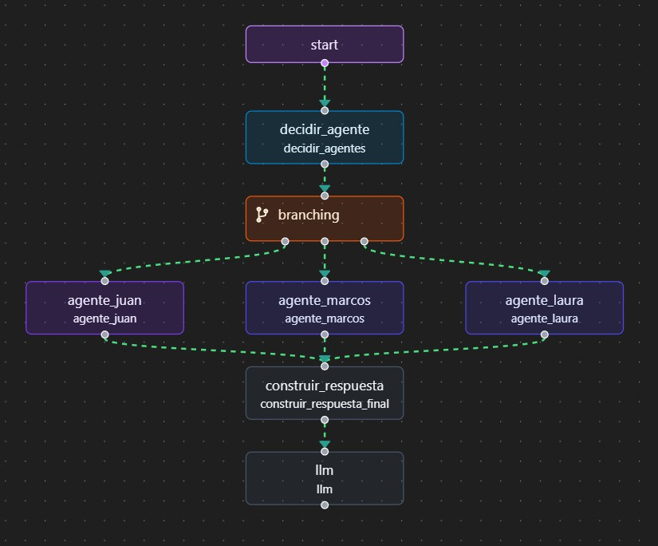

# TP1 - MIA
## RAG con memoria utilizando OpenIA, Pinecone, Langchain y Streamlit

##### 1) El RAG permite generar embeddings en Pinecone a partir de un pdf. Para ellos es necesario configurar, ademas del nombre del archivo, los parametros del split dentro de la funcion main_embeddings()
##### 2) Con la funcion main_request() se ejecuta Streamlit local para realizar la consulta. Ademas de la respuesta, devuelve el contexto y el historial.

# TP2 - MIA
## Agentes utilizando OpenIA, Pinecone, Langchain, LangGraph y Streamlit
##### El agente es capaz de responder preguntas sobre 3 CV que tiene precargados en Pinecone, a nombre de Laura, Marcos y Juan. Cada uno de estos CV es manegado por un agente. Es necesario ser explicito en la pregunta con los nombres de las personas que se desea consultar. En caso que no exista ningun nombre, responde por el CV de Juan.

# TP3 - MIA
# 🧠 Asistente de Estrategia Empresarial

Este proyecto implementa un sistema basado en agentes capaces de colaborar para responder preguntas relacionadas con la estrategia de lanzamiento y gestión de productos en el mercado.

---

## 🚀 ¿Cómo funciona?

Cuando el usuario ingresa una pregunta, el sistema:

1. Analiza la pregunta y selecciona automáticamente qué agentes especializados deben intervenir.
2. Cada agente aporta su respuesta en base a su área de especialización.
3. Las respuestas se combinan para construir una respuesta final completa y coherente.
4. Si la pregunta no está relacionada con los temas disponibles, el sistema responde:  
   _"No estoy preparado para responder sobre ese tema."_

---

## 🧩 Agentes disponibles

- **Agente de Mercado**:  
  Especialista en análisis de tendencias de mercado, comportamiento del consumidor y evaluación de la competencia.

- **Agente de Marketing**:  
  Especialista en estrategias de promoción, segmentación de clientes y tácticas de comunicación comercial.

- **Agente de Distribución**:  
  Especialista en planificación de canales de distribución, logística comercial y expansión a nuevos mercados.

- **Agente Sin-Especialización**:  
  Responde cuando la pregunta no corresponde a ninguna de las áreas anteriores.

---

## 🛠️ Tecnologías utilizadas

- Python 3
- OpenAI API (gpt-3.5-turbo)
- Streamlit

---

## 📋 Ejemplos de preguntas

- ¿Cómo lanzar un nuevo producto al mercado?
- ¿Qué estrategia de marketing me recomiendan para un producto tecnológico?
- ¿Cómo puedo organizar la distribución de un nuevo producto en diferentes regiones?
- ¿Me podés explicar cómo resolver una ecuación matemática? _(En este caso el sistema indicará que no está preparado para responder)_

